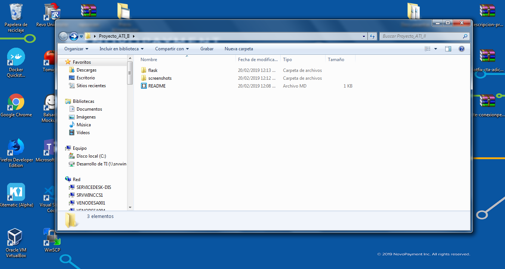

# API REST con Python Flask

Conexión Personas Online es un portal web orientado a proporcionar servicios para los usuarios finales de productos Tebca/Servitebca.

### Dependencias

- Python
- flask
- flask_restful 

### Instalación de módulos flask y flask_restful

Situarse en el directorio /flask y ejecutar el siguiente comando:
```
pip install -r dependencias.txt
```

### Iniciar servidor

Situarse en el directorio /flask/API_REST y ejecutar el siguiente comando:
```
python run.py
```

## Ejemplos para las Peticiones HTTP

### GET


### POST


### PUT


### DELETE


